# Aplikasi Jualan

Aplikasi Android sederhana yang dibuat menggunakan Kotlin dan Jetpack Compose
sebagai tugas praktikum Pemrograman Mobile.

## Identitas

| Keterangan | Detail            |
|---|-------------------|
| Nama | ASTRIA DINA FITRI |
| NIM | H1D024004         |
| Shift KRS | Shift B           |
| Shift WAR | Shift F           |
| Pertemuan | Pertemuan ke-2    |

## Tampilan Aplikasi Pertemuan 4

### 1. Komponen Utama & Preview

**Menu Action di AppBar**  
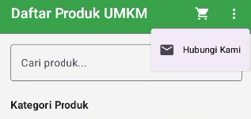

**Preview Daftar Produk (`DaftarProdukScreenPreview`)**  
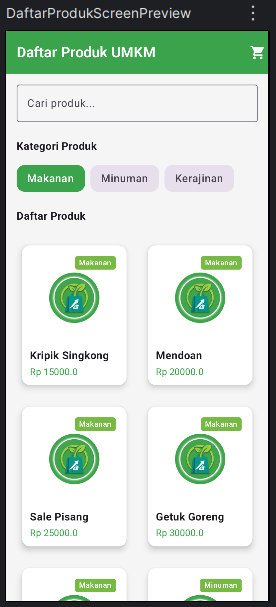

**Preview Detail Produk (`DetailProductScreenPreview`)**  
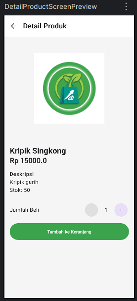

**Preview Hubungi Kami (`HubungiKamiScreenPreview`)**  
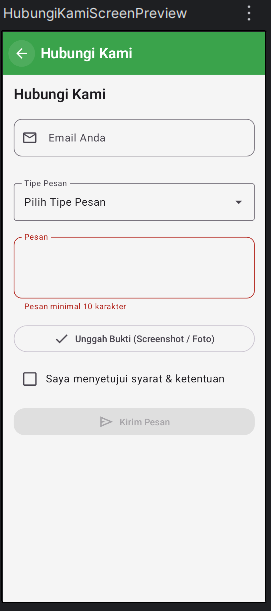

---

### 2. Mode Terang (Light Mode - Pertemuan 4)

**Halaman Daftar Produk (Light Mode)**  
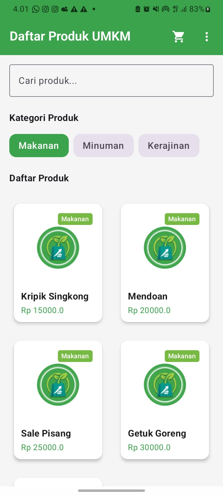

**Halaman Detail Produk (Light Mode)**  
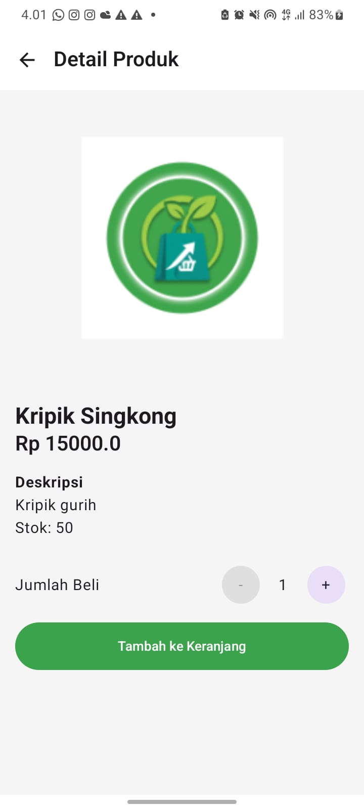

**Halaman Hubungi Kami (Light Mode)**  
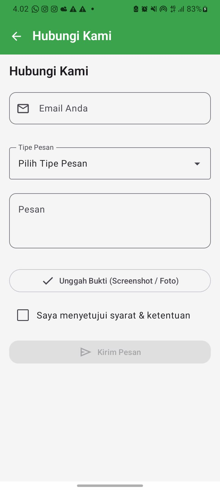

---

### 3. Mode Gelap (Dark Mode - Pertemuan 4)

**Halaman Daftar Produk (Dark Mode)**  
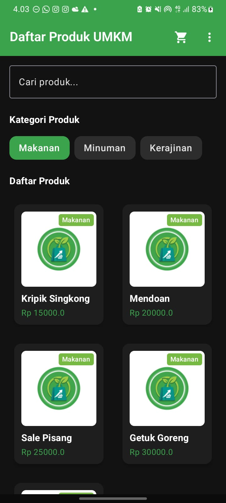

**Halaman Detail Produk (Dark Mode)**  
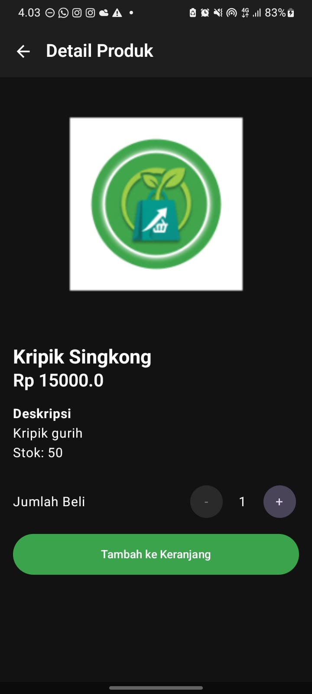

**Halaman Hubungi Kami (Dark Mode)**  
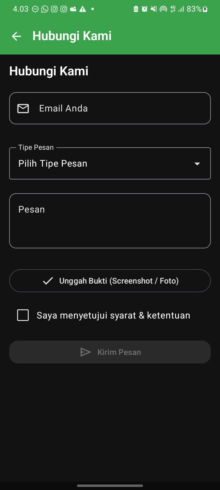

---

### 4. Demo Aplikasi (Pertemuan 4)
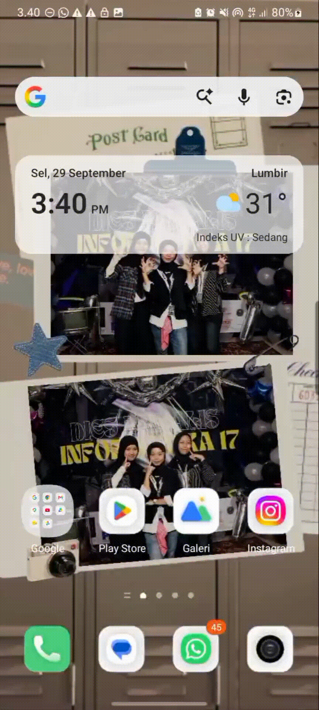

---

## Tampilan Aplikasi Pertemuan 3

### 1. Komponen Utama

**TopAppBar Aplikasi**  

**Preview Kategori**  

**Preview Produk**  

---

### 2. Mode Terang (Light Mode - Pertemuan 3)

**Kategori Kerajinan (Light Mode)**  
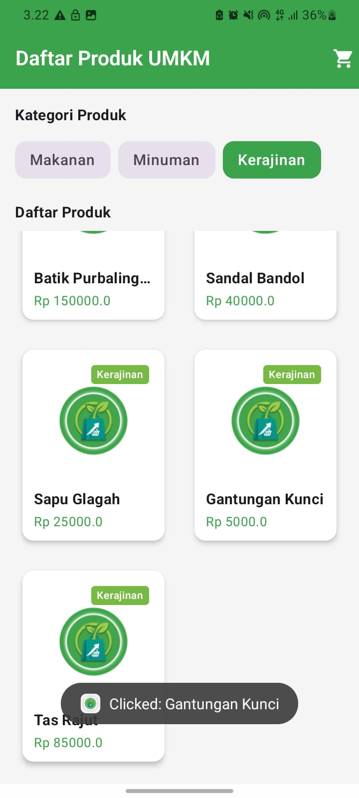

**Kategori Makanan (Light Mode)**  
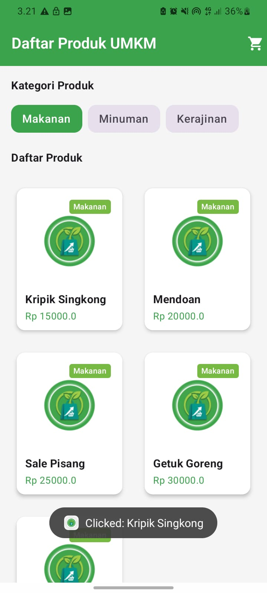

**Kategori Minuman (Light Mode)**  
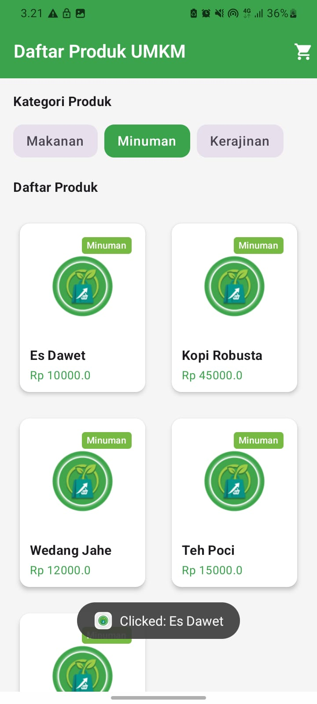

---

### 3. Mode Gelap (Dark Mode - Pertemuan 3)

**Kategori Kerajinan (Dark Mode)**  
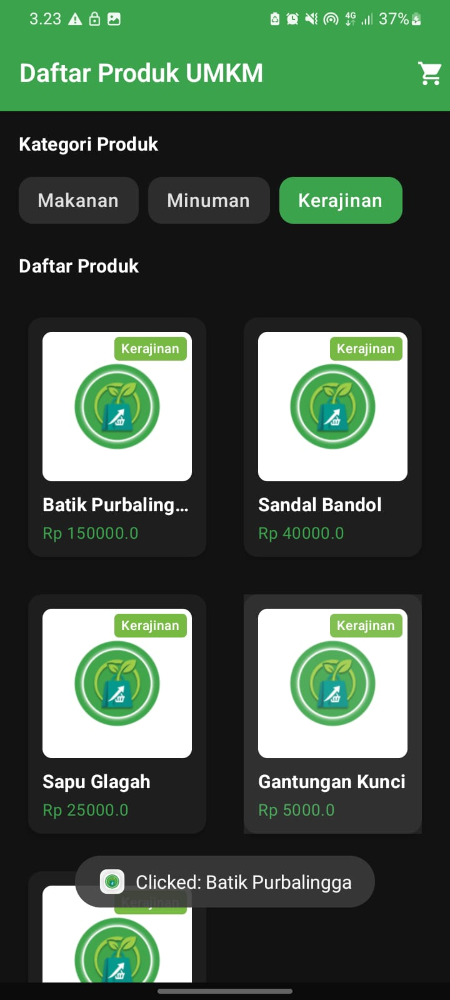

**Kategori Makanan (Dark Mode)**  
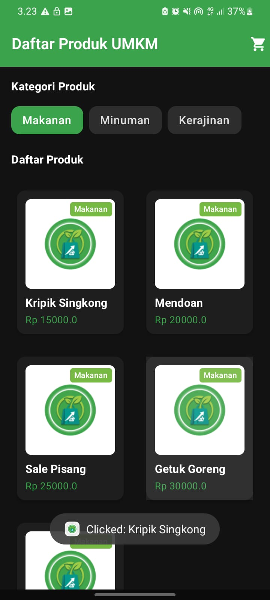

**Kategori Minuman (Dark Mode)**  
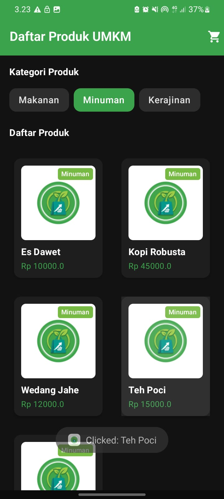

---

### 4. Demo Aplikasi (Pertemuan 3)
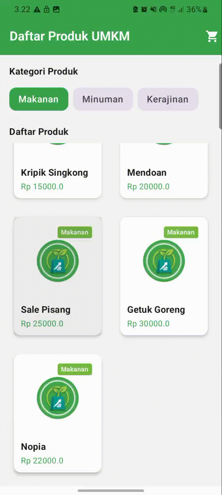

---

## Tampilan Aplikasi Pertemuan 2

### 1. Light Mode (Pertemuan 2)

**Halaman Informasi Dasar (`BasicInfoScreen`)**  
.jpeg)

**Halaman Hubungi Kami (`HubungiKamiScreen`)**  
.jpeg)

**Feedback Snackbar (`ShowSnackbar`)**  
.jpeg)

---

### 2. Dark Mode (Pertemuan 2)

**Halaman Informasi Dasar (`BasicInfoScreen`)**  
.jpeg)

**Halaman Hubungi Kami (`HubungiKamiScreen`)**  
.jpeg)

**Feedback Snackbar (`ShowSnackbar`)**  
.jpeg)

---

## Lampiran Tugas Pertemuan 1

**Tampilan Aplikasi Pertemuan 1**  
